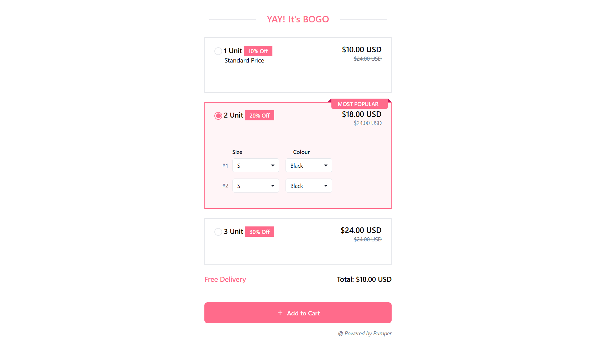

# Responsive Pricing Component

This repository contains a **responsive pricing component** built entirely with HTML, CSS and JS. The design incorporates modern UI/UX principles, media responsiveness, and dynamic styling to create an interactive and visually appealing pricing selection interface.

---

## Features

1. **Responsive Design**:

   - Adjusts seamlessly for various screen sizes (desktop, tablet, mobile).
   - Uses media queries for mobile-first design principles.

2. **CSS Variables**:

   - Easily customizable colors and themes using CSS variables (`:root`).

3. **Interactive Styles**:

   - Active states for pricing boxes.
   - Custom radio button styles with hover and checked effects.

4. **Dynamic Elements**:

   - Discount badges, pricing ribbons (`Most Popular`), and styled drop-downs.
   - Clear distinction between current and original prices.

5. **Accessibility**:
   - Tab focus styling for better navigation.
   - Clear and readable font sizes and contrasts.

---

## Folder Structure

```
📁 bogo
├── 📄 index.html
├── 📄 index.js
├── 📄 styles.css
└── 📄 README.md
```

---

## How to Use

### Installation

1. **Clone the Repository**:

   ```bash
   git clone https://github.com/sourabh-bhatt/bogo.git
   cd bogo
   ```

2. **Open the Component**:
   - Open the `index.html` file in any modern browser.

### Customization

- Modify variables in the `:root` section of `styles.css` for color customization.
- Adjust grid layouts or element sizes if needed for your specific use case.

---

## Preview


<video controls src="testingVideo.mp4" title="Title"></video>

---

## License

Distributed under the MIT License. See `LICENSE` for more information.

## Deployed Link
